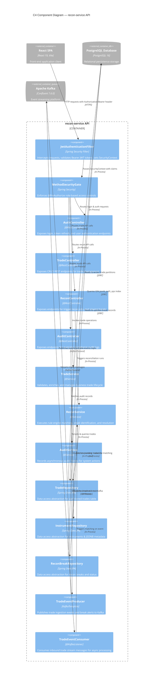

# TICKET-ADV004 — C4 Level 3 Component Diagram

```mermaid
C4Component
    title C4 Component Diagram — recon-service API

    Container_Ext(spa, "React SPA", "React 19, Vite", "Front-end application client")
    ContainerDb_Ext(db, "PostgreSQL Database", "PostgreSQL 16", "Relational persistence storage")
    ContainerQueue_Ext(kafka, "Apache Kafka", "Confluent 7.6.0", "Event streaming platform")

    Container_Boundary(apiBoundary, "recon-service API") {
        Component(jwtFilter, "JwtAuthenticationFilter", "Spring Security Filter", "Intercepts requests, validates Bearer JWT tokens, sets SecurityContext")
        Component(secGate, "MethodSecurityGate", "Spring Security", "Enforces @PreAuthorize role-based access controls")

        Component(authController, "AuthController", "@RestController", "Exposes login, token refresh, and user authentication endpoints")
        Component(tradeController, "TradeController", "@RestController", "Exposes CRUD REST endpoints for trade management")
        Component(reconController, "ReconController", "@RestController", "Exposes endpoints for trigger recon jobs and viewing breaks")
        Component(auditController, "AuditController", "@RestController", "Exposes endpoints for querying compliance audit logs")

        Component(tradeService, "TradeService", "@Service", "Validates, enriches, and manages business trade lifecycle")
        Component(reconService, "ReconService", "@Service", "Executes rule engine matching, break identification, and resolution")
        Component(auditService, "AuditService", "@Service", "Records asynchronous audit history for system actions")

        Component(tradeRepo, "TradeRepository", "Spring Data JPA", "Data access abstraction for partitioned trades table")
        Component(instrumentRepo, "InstrumentRepository", "Spring Data JPA", "Data access abstraction for instruments & JSONB metadata")
        Component(reconBreakRepo, "ReconBreakRepository", "Spring Data JPA", "Data access abstraction for recon breaks and status")

        Component(kafkaProducer, "TradeEventProducer", "KafkaTemplate", "Publishes trade ingestion events and break alerts to Kafka")
        Component(kafkaListener, "TradeEventConsumer", "@KafkaListener", "Consumes inbound trade stream messages for async processing")
    }

    Rel(spa, jwtFilter, "HTTP requests with Authorization Bearer header", "HTTPS")
    Rel(jwtFilter, secGate, "Passes SecurityContext with claims", "In-Process")

    Rel(secGate, authController, "Routes login & auth requests", "In-Process")
    Rel(secGate, tradeController, "Routes trade API calls", "In-Process")
    Rel(secGate, reconController, "Routes recon API calls", "In-Process")
    Rel(secGate, auditController, "Routes audit API calls", "In-Process")

    Rel(tradeController, tradeService, "Invokes trade operations", "In-Process")
    Rel(reconController, reconService, "Triggers reconciliation runs", "In-Process")
    Rel(auditController, auditService, "Fetches audit records", "In-Process")

    Rel(tradeService, tradeRepo, "Persists & queries trades", "In-Process")
    Rel(tradeService, instrumentRepo, "Queries instrument metadata", "In-Process")
    Rel(tradeService, kafkaProducer, "Dispatches trade events / Kafka", "In-Process")

    Rel(reconService, reconBreakRepo, "Persists detected breaks", "In-Process")
    Rel(reconService, tradeRepo, "Fetches pending trades for matching", "In-Process")

    Rel(kafkaListener, reconService, "Triggers matching on event", "In-Process")

    Rel(tradeRepo, db, "Reads & writes trade partitions", "JDBC")
    Rel(instrumentRepo, db, "Queries GIN jsonb_path_ops index", "JDBC")
    Rel(reconBreakRepo, db, "Reads & updates break records", "JDBC")

    Rel(kafkaProducer, kafka, "Publishes events to trade-events topic", "Kafka Protocol")
    Rel(kafka, kafkaListener, "Streams trade messages", "Kafka Protocol")
```
