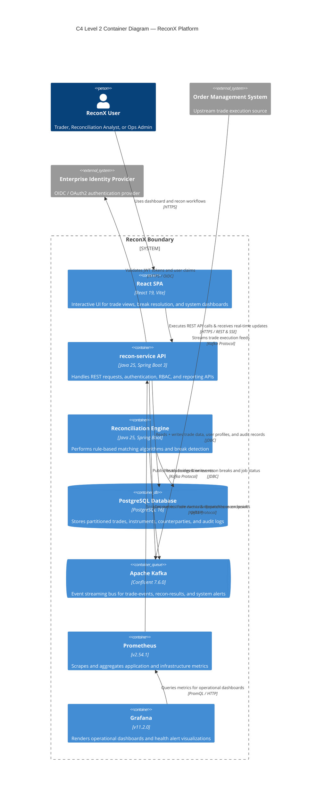

# TICKET-ADV003 — C4 Level 2 Container Diagram

```mermaid
C4Container
    title C4 Level 2 Container Diagram — ReconX Platform

    Person(user, "ReconX User", "Trader, Reconciliation Analyst, or Ops Admin")
    System_Ext(oms, "Order Management System", "Upstream trade execution source")
    System_Ext(sso, "Enterprise Identity Provider", "OIDC / OAuth2 authentication provider")

    System_Boundary(reconxBoundary, "ReconX Boundary") {
        Container(spa, "React SPA", "React 19, Vite", "Interactive UI for trade views, break resolution, and system dashboards")
        Container(api, "recon-service API", "Java 25, Spring Boot 3", "Handles REST requests, authentication, RBAC, and reporting APIs")
        Container(recon_engine, "Reconciliation Engine", "Java 25, Spring Boot", "Performs rule-based matching algorithms and break detection")
        ContainerDb(db, "PostgreSQL Database", "PostgreSQL 16", "Stores partitioned trades, instruments, counterparties, and audit logs")
        ContainerQueue(kafka, "Apache Kafka", "Confluent 7.6.0", "Event streaming bus for trade-events, recon-results, and system alerts")
        Container(prometheus, "Prometheus", "v2.54.1", "Scrapes and aggregates application and infrastructure metrics")
        Container(grafana, "Grafana", "v11.2.0", "Renders operational dashboards and health alert visualizations")
    }

    Rel(user, spa, "Uses dashboard and recon workflows", "HTTPS")
    Rel(spa, api, "Executes REST API calls & receives real-time updates", "HTTPS / REST & SSE")
    Rel(api, db, "Reads + writes trade data, user profiles, and audit records", "JDBC")
    Rel(api, kafka, "Publishes trade ingestion events", "Kafka Protocol")
    Rel(recon_engine, kafka, "Consumes trade events & dispatches recon results", "Kafka Protocol")
    Rel(recon_engine, db, "Reads trades & writes recon breaks and job status", "JDBC")
    Rel(api, sso, "Validates JWT tokens and user claims", "HTTPS / OIDC")
    Rel(oms, kafka, "Streams trade execution feeds", "Kafka Protocol")
    Rel(prometheus, api, "Scrapes metrics from /actuator/prometheus endpoint", "HTTP")
    Rel(grafana, prometheus, "Queries metrics for operational dashboards", "PromQL / HTTP")
```
