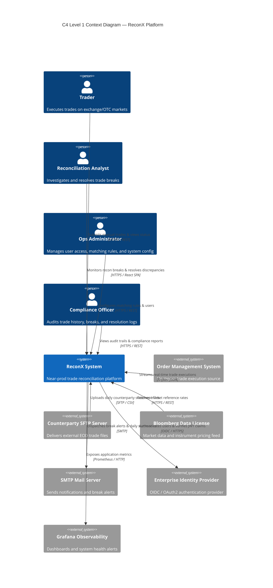

# TICKET-ADV002 — C4 Level 1 Context Diagram

```mermaid
C4Context
    title C4 Level 1 Context Diagram — ReconX Platform

    Person(trader, "Trader", "Executes trades on exchange/OTC markets")
    Person(recon_analyst, "Reconciliation Analyst", "Investigates and resolves trade breaks")
    Person(ops_admin, "Ops Administrator", "Manages user access, matching rules, and system config")
    Person(compliance, "Compliance Officer", "Audits trade history, breaks, and resolution logs")

    System(reconx, "ReconX System", "Near-prod trade reconciliation platform")

    System_Ext(oms, "Order Management System", "Upstream trade execution source")
    System_Ext(sftp, "Counterparty SFTP Server", "Delivers external EOD trade files")
    System_Ext(bloomberg, "Bloomberg Data License", "Market data and instrument pricing feed")
    System_Ext(email, "SMTP Mail Server", "Sends notifications and break alerts")
    System_Ext(sso, "Enterprise Identity Provider", "OIDC / OAuth2 authentication provider")
    System_Ext(grafana, "Grafana Observability", "Dashboards and system health alerts")

    Rel(trader, reconx, "Submits manual trades & views status", "HTTPS / REST")
    Rel(recon_analyst, reconx, "Monitors recon breaks & resolves discrepancies", "HTTPS / React SPA")
    Rel(ops_admin, reconx, "Configures matching rules & users", "HTTPS / REST")
    Rel(compliance, reconx, "Views audit trails & compliance reports", "HTTPS / REST")

    Rel(oms, reconx, "Streams real-time trade executions", "Kafka / JSON")
    Rel(sftp, reconx, "Uploads daily counterparty statement files", "SFTP / CSV")
    Rel(bloomberg, reconx, "Fetches market reference rates", "HTTPS / REST")
    Rel(reconx, email, "Dispatches break alerts & daily summaries", "SMTP")
    Rel(reconx, sso, "Authenticates users & verifies JWT claims", "OIDC / HTTPS")
    Rel(reconx, grafana, "Exposes application metrics", "Prometheus / HTTP")
```
