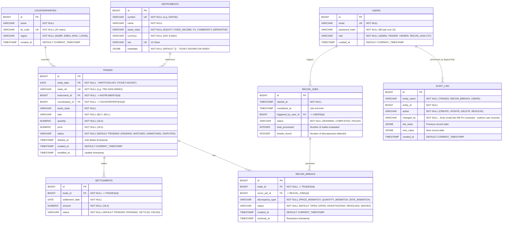

# TICKET-ADV006 — ReconX Entity-Relationship Model (8 Entities)

```mermaid
erDiagram
    COUNTERPARTIES ||--o{ TRADES : "executes"
    INSTRUMENTS ||--o{ TRADES : "references"
    TRADES ||--o{ SETTLEMENTS : "settles"
    TRADES ||--o{ RECON_BREAKS : "has"
    RECON_JOBS ||--o{ RECON_BREAKS : "generates"
    USERS ||--o{ RECON_JOBS : "triggers"
    USERS ||--o{ AUDIT_LOG : "performed_by (logical link)"

    COUNTERPARTIES {
        BIGINT id PK
        VARCHAR name "NOT NULL"
        VARCHAR lei_code UK "NOT NULL (20 chars)"
        VARCHAR region "NOT NULL (NAMR, EMEA, APAC, LATAM)"
        TIMESTAMP created_at "DEFAULT CURRENT_TIMESTAMP"
    }

    INSTRUMENTS {
        BIGINT id PK
        VARCHAR symbol UK "NOT NULL (e.g. SAP.DE)"
        VARCHAR name "NOT NULL"
        VARCHAR asset_class "NOT NULL (EQUITY, FIXED_INCOME, FX, COMMODITY, DERIVATIVE)"
        VARCHAR currency "NOT NULL (ISO 3-letter)"
        VARCHAR isin UK "12 chars"
        JSONB metadata "NOT NULL DEFAULT '{}' - TICKET-ADV009 GIN INDEX"
    }

    USERS {
        BIGINT id PK
        VARCHAR email UK "NOT NULL"
        VARCHAR password_hash "NOT NULL (BCrypt cost 10)"
        VARCHAR role "NOT NULL (ADMIN, TRADER, VIEWER, RECON_ANALYST)"
        TIMESTAMP created_at "DEFAULT CURRENT_TIMESTAMP"
    }

    TRADES {
        BIGINT id PK
        DATE trade_date PK "NOT NULL - PARTITION KEY (TICKET-ADV007)"
        VARCHAR trade_ref UK "NOT NULL (e.g. TRD-2026-000001)"
        BIGINT instrument_id FK "NOT NULL -> INSTRUMENTS(id)"
        BIGINT counterparty_id FK "NOT NULL -> COUNTERPARTIES(id)"
        VARCHAR asset_class "NOT NULL"
        VARCHAR side "NOT NULL (BUY, SELL)"
        NUMERIC quantity "NOT NULL (18,4)"
        NUMERIC price "NOT NULL (18,4)"
        VARCHAR status "NOT NULL DEFAULT 'PENDING' (PENDING, MATCHED, UNMATCHED, DISPUTED)"
        TIMESTAMP deleted_at "Soft delete timestamp"
        TIMESTAMP created_at "DEFAULT CURRENT_TIMESTAMP"
        TIMESTAMP modified_at "Update timestamp"
    }

    SETTLEMENTS {
        BIGINT id PK
        BIGINT trade_id FK "NOT NULL -> TRADES(id)"
        DATE settlement_date "NOT NULL"
        NUMERIC amount "NOT NULL (18,4)"
        VARCHAR status "NOT NULL DEFAULT 'PENDING' (PENDING, SETTLED, FAILED)"
    }

    RECON_JOBS {
        BIGINT id PK
        TIMESTAMP started_at "NOT NULL"
        TIMESTAMP completed_at "Job end time"
        BIGINT triggered_by_user_id FK "-> USERS(id)"
        VARCHAR status "NOT NULL (RUNNING, COMPLETED, FAILED)"
        INTEGER total_processed "Number of trades evaluated"
        INTEGER breaks_found "Number of discrepancies detected"
    }

    RECON_BREAKS {
        BIGINT id PK
        BIGINT trade_id FK "NOT NULL -> TRADES(id)"
        BIGINT recon_job_id FK "-> RECON_JOBS(id)"
        VARCHAR discrepancy_type "NOT NULL (PRICE_MISMATCH, QUANTITY_MISMATCH, DATE_MISMATCH)"
        VARCHAR status "NOT NULL DEFAULT 'OPEN' (OPEN, INVESTIGATING, RESOLVED, WAIVED)"
        TIMESTAMP created_at "DEFAULT CURRENT_TIMESTAMP"
        TIMESTAMP resolved_at "Resolution timestamp"
    }

    AUDIT_LOG {
        BIGINT id PK
        VARCHAR entity_name "NOT NULL (TRADES, RECON_BREAKS, USERS)"
        BIGINT entity_id "NOT NULL"
        VARCHAR action "NOT NULL (CREATE, UPDATE, DELETE, RESOLVE)"
        VARCHAR changed_by "NOT NULL - Actor email (No DB FK constraint - outlives user records)"
        JSONB old_value "Previous record state"
        JSONB new_value "New record state"
        TIMESTAMP created_at "DEFAULT CURRENT_TIMESTAMP"
    }
```
